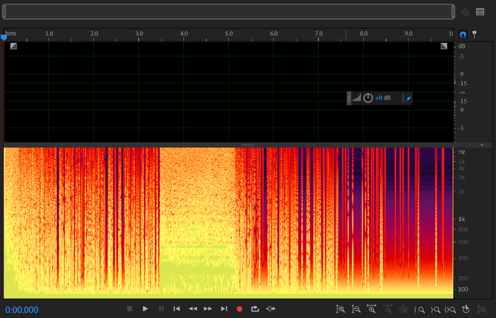
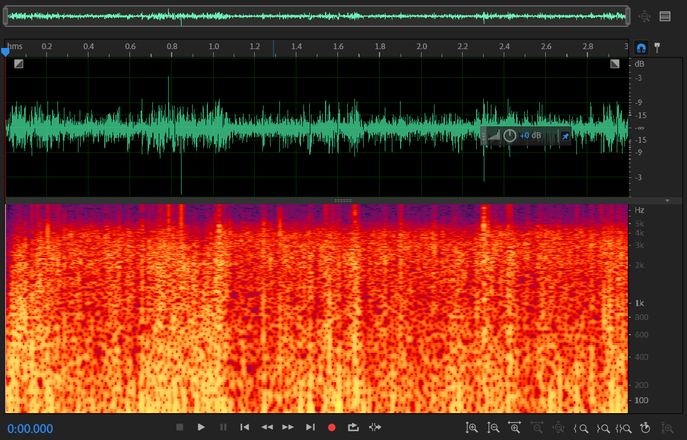
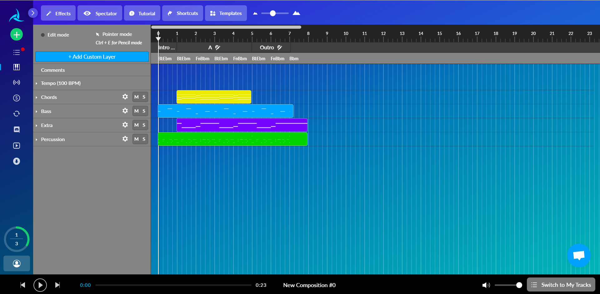
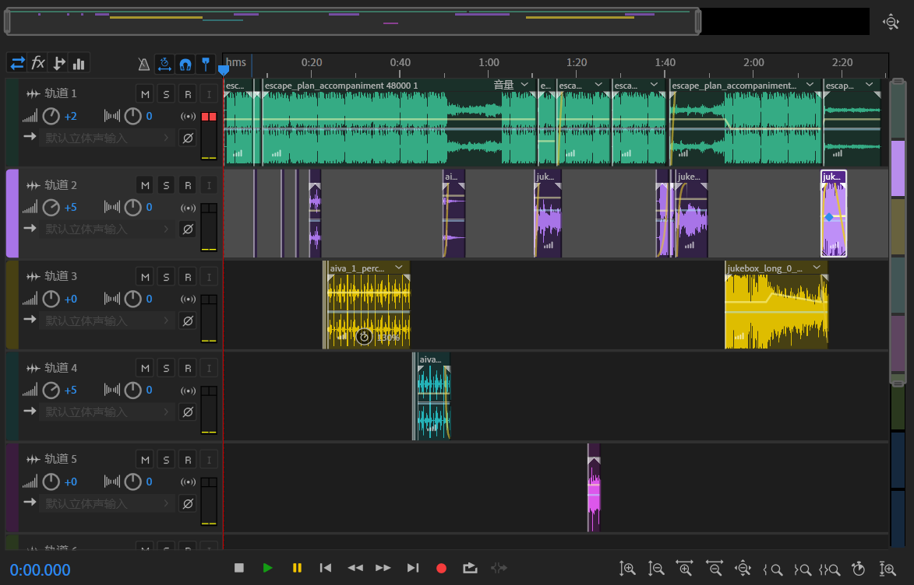

# Sravillit Tcoss
## A.rt I.ntel Project 3: Sound and Text

Created by William Zhang [cz1627@nyu.edu](cz1627@nyu.edu)

### Project Link: https://mstxy.github.io/Sravillis_Tcoss/

### Abstract
This project uses several A.I. sound tools (SampleRNN, Jukebox, AIVA, Spleeter, WaveNet) and text tools (GPT-2, GPT-J-6B) to create a fake artist: Sravillit Tcoss that DOES NOT work as smoothly as one would have expected. Intentional glitches in audio, visual and textual elements are added to emphasis such A.I. failure. Through this project, I hope to experiment with various tools and more importantly, address on the limitation of A.I., and warn towards a blind trust and usage of A.I..

### 1. Inspiration
The inspiration of creating a fake artist is from my initial idea of utilizing both text and sound tools to create a project. The best medium for text & sound is songs, which includes lyrics and music. Therefore, at very early stage I've set the goal to be creating a song and an artist page. However, after some experiment with the sound tools, especially SampleRNN, I found that the quality of the audio generated from my own training was not ideal at all. And that's when I made the decision to stop further training and concluded that the sound tools are not capable of generating good audios. So, I shifted my project idea from creating a "good" fake artiist to a "failed" fake artist. To emphasize on the "failed" concept, I deliberately included the failed clips from multiple models. Also, because generating voices and music at the same time now seeems limited, I decided to separate the lyrics and music in the artist page.  
Because it is a fake artist and generating audio clips requires training on certain audio datasets, I choose to build it upon an existing artist: Travis Scott to keep a consistent theme. The project name: Sravillis Tcoss, therefore, is a reorganization of the characters of Travis Scott's name. By just swapping the "S"'s and "T"'s, it would be clear who this fake artist is build upon. I also played with the i to create sort of a buggy visual, which is aimed to give the viewers a first idea that this could probably be a fake artist that does not work so well.

### 2. Sound Production
#### 2.1 Spleeter
For sound tools, the first useful tool I found is Spleeter, https://github.com/deezer/spleeter. It also has a convenient Google Colab tool: https://colab.research.google.com/github/deezer/spleeter/blob/master/spleeter.ipynb. It is compiled to a Python library and basically does the job of separating the accompaniment and vocal audio from a song that was input. It needs no training and the result is acceptable (much better compared to other tools mentioned below), of course, it is more of a editing tool than a creation tool. 
A sample output from Spleeter:
* Accompaniment: [Accompaniment](doc/spleeter/accompaniment.wav)
* Vocal: [Vocal](doc/spleeter/vocals.wav)
* Original Song: [Durag Activity - Baby Keem, Travis Scott](doc/spleeter/durag_activity.mp3)
Because the result is ideal (only a small portion of it is a bit distorted), but without anything innovative, I spleeted Travis Scott's new song: [Escape Plan](https://www.youtube.com/watch?v=ve_iZT4Huuo), and use the accompaniment as the base for my later edited track.

#### 2.2.1 SampleRNN-pytorch
SampleRNN is the first tool I tried, refering to this [blog post](https://karlhiner.com/music_generation/wavenet_and_samplernn/) by karlhiner. In the blog post, it is claimed that the result from SampleRNN is actually better than WaveNet, so I decided to try SampleRNN. Because I assume that having vocals in the training data would be impedeing the performance of SampleRNN, I choose [👾Hip Hop/Trap Instrumental Beats Mix 2021 | 1 HOUR #7](https://www.youtube.com/watch?v=1s6-_1IO3gg) on YouTube. Multiple github repositories were tried, and in total I ran about 5 tests, each for approximately 8 hours, and none of them yield any good result: half were silent and another half contain only vibrations of a single tone. By opening it and looking at the spectrograms, it turns out that the model have achieved nothing: . The corresponding file is [here](doc/samplernn/ep41-s2.wav). I even tried to train on the same dataset the blog post used that generates some decent result, it is still the same vibration and noises. One possible reasons are the version of pytorch the [original repository](https://github.com/deepsound-project/samplernn-pytorch) used are way too old (PyTorch 0.1.12). I also tried to modify some code pieces to get rid of deprecation warnings but the result remains the same.

#### 2.2.2 PRiSM-SampleRNN
With the failure mostly depend on package versions (as I thought then), I search and found this tool: [PRiSM-SampleRNN](https://github.com/rncm-prism/prism-samplernn), which is a community version hoping to "bring samplernn back to life". However, after three attempts with different parameters such as sample-rate, sampling-temperature, nothing good is generated: it is still monotonus noises, but surely something better about it is that it finally have oscillogram, and the noise is more "consistent". . The corresponding file is [here](doc/samplernn/please_e=1_t=0.95.wav). Because the result seems to be something, but training for more time has no effect on the output quality, I suspect that it might be certain features of my training set, the 1h trap beat that is impeding the training, either too quite on certain pieces or too heavy on the drum beats. But by then I have decided to work on glitch music, so I did not make any further attempts. The above noise clip is included in the final audio created. 

#### 2.3 WaveNet & WaveGAN
I also tried to use [WaveNet](https://github.com/ibab/tensorflow-wavenet) and [WaveGAN](https://github.com/chrisdonahue/wavegan), the result is similar, so they are not further explored and are not included in the final audio.

#### 2.4 OpenAI Jukebox
Jukebox becomes much more easier to work with after the modification made by professor Mang: https://github.com/mangtronix/jukebox. I generated multiple 20s and two 60s from Travis Scott's Highest in the Room, and Escape Plan (the base track I use to create the final audio). The used files are here:
* [doc/jukebox/jukebox_first_2.wav](doc/jukebox/jukebox_first_2.wav)
* [doc/jukebox/jukebox_long_0_1.wav](doc/jukebox/jukebox_long_0_1.wav)
* [doc/jukebox/jukebox_sec_1.wav](doc/jukebox/jukebox_sec_1.wav)
Audio generations of different stages are used, and mostly are from early stages for the glitch effect. The first and sec wav are used for short clips in the final audio to give glitched effects (the jibberish from jukebox after 10 seconds of generation is inspiring). And the long wav are used for the final verse in the final audio, just to see the potential of jukebox, and the result within 30 seconds are very decent. Some interesting observation: 
* Artist travis scott is in the jukebox artist list, which means jukebox was trained specifically on Travis Scott's song, and I can really identify some moments in the generated audio that are from certain songs of Travis Scott, which is pretty cool.
* Some attempts leads to a total different style after 10 seconds, and the Travis Scott style hip hop suddenly becomes Korean hip hop.
* The jukebox [v2_genre_ids.txt](https://github.com/openai/jukebox/blob/master/jukebox/data/ids/v2_genre_ids.txt) seems corrupted, as 'lo-fi' are being in two categories 'lo' and 'fi', and 'hip-hop' into 'hip' and 'hop'. Not sure it's a bug or it's just the mechanism.
Overall, Jukebox yields the best result from a sample audio, though still limited to the length of audio generation.

#### 2.6 AIVA
AIVA is a online A.I. music generator, which allows me to prompt in music genres and some specifications to generate music. I prompt in Hip Hop and Trap and the generated music look like this: , which has separated track for different instruments/components. Still, this tool could only generate basic components for a music track, and is less of a creative tool. So I take advatange of the components and mainly use the base and percussion in the final edited audio. 

#### 2.7 Adobe Audition
Because I want to show the original glitch and emphasize on the failed output from A.I. outputs, I did not add much effect to the clips, but mainly tweak the volume, the arrangement and the speed of the clips. And this is a screenshot of the Adobe Audition editing: . The final audio could be find [here](Demo.mp3) or on the project site.

### 3. Text Production
#### 3.1 GPT-2
For the lyrics in the artist page, I used [GPT-2 simple on Google Colab](https://colab.research.google.com/github/sarthakmalik/GPT2.Training.Google.Colaboratory/blob/master/Train_a_GPT_2_Text_Generating_Model_w_GPU.ipynb) to generate these lyrics. The train set is created by pulling the lyrics of Travis Scott's past albums, with title and some unnecessary notation removed, the training txt file is [here](astroworld_lyrics.txt). I tried to include as many lyrics as possible to maximize training performance. 
Then, for the prompt of generating the lyrics, I get inspiration from the latest Astroworld music festival tragedy, on which Travis Scott is widely blamed. I wrote my own first 4 lines of lyrics and then let GPT-2 generate on its own. The prompted first 4 lines are:
*Astroworld, astro weird,
Throw the flame on me. (no)
Fans really mean the world to me, (ya)
Hope you all rest in peace. (peace)*
The result is not consistent, therefore, I have to generate several times and hand pick the best results with some minor editing. The final result could be seen on the lyrics tab on the project site.

#### 3.2 GPT-J-6B
For artist description, I use GPT-J-6B, https://6b.eleuther.ai/. It is quite interesting how I had to manipulate the prompt to get what I want. For example, the prompt: *"Ayo! This is Sraviiiiit Tcoss, rapper and producer."* would only give me interview scripts, but *"I am Sraviiiiit Tcoss, a rising rapper and producer. "* would give a decent self-introduction. 
More interesting (and striking), is the unwanted output from GPT-J-6B, which clearing indicates the lack of supervision of their training datasets: *"Ayo! This is Sraviiiiit Tcoss, rapper and producer. I’m so excited to be doing this interview with you because I’ve been a fan of yours for years. **You are the first rapper I remember hearing who was a young, black, queer, feminist, and trans woman who was also writing rap songs. I think you are also the first rapper to have an album called “Savage Love” that was all about sex.**..."* This kind of comments, as far as I am concerned, would only appear in those tweets that make sarcastic comments on political correctness, which should not be allowed in a training set.
Still, this was a serendipity, so I also included it in the website, which would show up when the website is 'glitched'.

#### 3.3 GPT-3
One disappointment is that I finally get the OpenAI API beta and have access to GPT-3 on 11/13, but by then I am already wrapping up my project. So it is really a shame I could not experiment with it. 

### 4. Website Design

### 5. Future Developments
Ye Bot.

